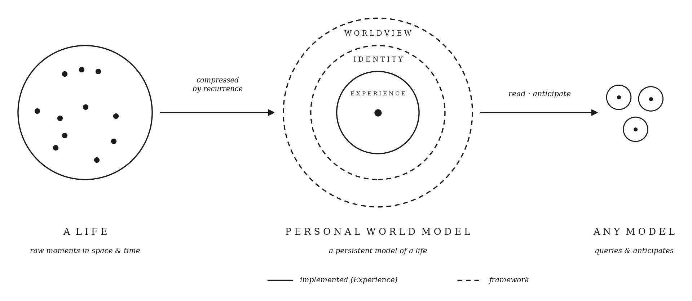
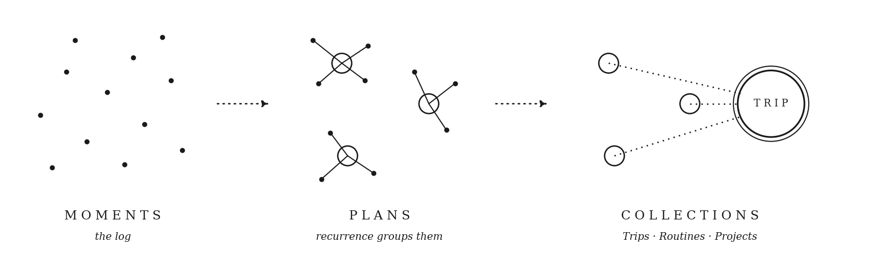
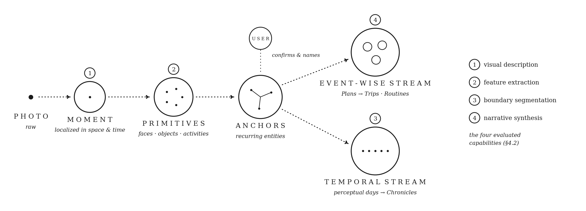

# Personal World Models

**Hana Azab · María Benavente**
Kinship Technologies

[**Paper (PDF)**](https://personalworldmodels.github.io/pwm.pdf) · [**Project page**](https://personalworldmodels.github.io) · [**Package**](https://personalworldmodels.github.io/golgi-0.1.0-macos-arm64.zip) · [**Supplement**](docs/supplement/README.md)

<p align="center">
  
</p>

Memory is a compression problem. Current systems treat it as retrieval, which can say what happened but not what it means or what comes next. A **Personal World Model (PWM)** is a life compressed the way a map compresses territory: what recurs becomes structure, and any model can read the structure and anticipate from it. **GOLGI** instantiates the framework: it ingests a real four-week photo archive — 720K tokens of raw life — into anchored entities, routines, and narratives an agent traverses in hundreds of tokens, on a pipeline that runs end-to-end on 4B on-device models.

## Results

An agent reading the committed structure, against a matched flat-retrieval control and production memory systems over the same archive (50 personal-history questions, fixed answer and judge models — only the memory layer varies):

| Memory layer | Correctness |
|---|---:|
| **GOLGI** | **46** |
| GraphRAG | 30 |
| Supermemory | 29 |
| Matched flat-retrieval control | 19 |
| Flat retrieval (vanilla) | 17 |
| Mem0 | 15 |
| Zep | 6 |

- **Structure is causal, not decorative:** corrupting the structure degrades answers in step with its fidelity (*r* = 0.81 across 36 corrupted variants, permutation *p* < 10⁻³); random groupings of the same shape give the agent almost nothing.
- **Anticipation:** predicting from the places the structure anchors retrieves the *exact* masked, unseen moment 32% of the time where a structure-free baseline reaches 0% (chance < 1%); replicates across a second encoder (DINOv2) and a second subject.
- **On-device:** 4B models (Ollama, Q4_K_M) reach up to 82% end-to-end parity with the cloud reference across all four pipeline capabilities.

<p align="center">
  
</p>

## The pipeline

Photos enter as **Moments**; **Primitives** (faces, objects, activities, spaces, text) are extracted per moment; recurring Primitives are promoted to **Anchors** with user confirmation; the anchored stream is synthesized into **Narratives** — Plans, Trips, Routines, and Chronicles. Everything is computed once, at ingestion, and read by agents through MCP.

<p align="center">
  
</p>

## Try it on your own camera roll

The evaluation archive is private (it is a life); the intended reproduction is to run the pipeline on your own photos. The [package](https://personalworldmodels.github.io/golgi-0.1.0-macos-arm64.zip) (macOS arm64, Python 3.12) ingests a photo directory end-to-end in cloud (Gemini) or fully on-device (Ollama) mode and exposes the structure over MCP:

```bash
pip install golgi-0.1.0-*.whl
golgi ingest -p my_persona -m on-device   # or -m cloud
golgi mcp -p my_persona --transport stdio
```

The [supplement](supplement/README.md) contains the four ingestion-stage prompts verbatim, the judge rubrics, model/quantization/decoding configurations, promotion thresholds, and the benchmark harness with all baseline adapters.

## Citation

```bibtex
@misc{azab2026pwm,
  title  = {Personal World Models},
  author = {Azab, Hana and Benavente, Mar{\'i}a},
  year   = {2026},
  url    = {https://personalworldmodels.github.io}
}
```
